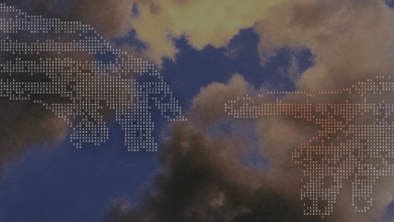
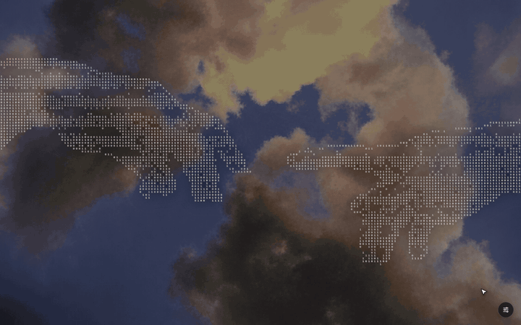

# DaVinci

The *Creation of Adam* hands, drawn entirely from 1s and 0s, with a Laravel-style cursor glow.

Inspired by the binary-art hero on Laravel's error page: move your mouse and nearby digits flip and burn red-orange, then cool back down.



## Customize
Open `index.html` in a browser.




To save :

1. Click **Save for wallpaper**. It downloads `davinci.html` with your settings inside.
2. Run `./install.sh ~/Downloads/davinci.html`. It keeps only your settings, in `~/.config/davinci/settings.json`, and updates the wallpaper. `index.html` in the repo is never changed, so it keeps the defaults.

Later `./install.sh` runs, for example after pulling new code, reuse your saved settings. Delete `~/.config/davinci/settings.json` and run `./install.sh` again to go back to the defaults.

The settings button is hidden when the page runs as the wallpaper.

## Apply as wallpaper

### 1. KDE ( Needs `qt6-webengine`)

```sh
./install.sh <downloaded .html>
```

Installs the wallpaper and sets it on every desktop.

### 2. Other Distro & OS

Not yet but open to collaborate.

## How it works

- A grayscale image of the hands is embedded in the file as a data URI.
- The page samples the image's brightness on a grid and places a digit at each lit pixel, dimmer or brighter to match the painting's shading.
- Each digit tracks a "heat" value: the cursor raises it (digit flips randomly and blends toward the glow color), then it decays each frame.
- The sky behind the hands is blurred and darkened in a soft hand-shaped patch so the digits stay readable.
- On KDE, the desktop icon layer sits above the wallpaper and eats mouse events, so the wallpaper plugin reads the cursor with a see-through layer on top and hands it to the page.
